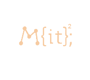
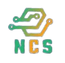
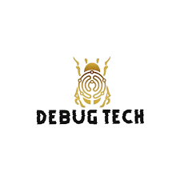
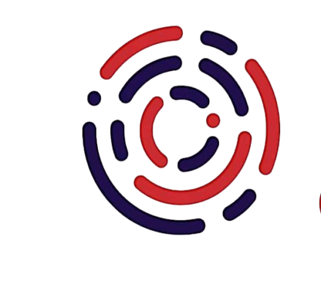
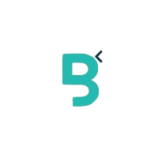

## Smart Software Solution
- _Web Developer_ | Jul'23 - Jun'24
- 
- Tags: Debugging,Full Stack
- Badges:
  - Laravel [yellow]
  - PHP [purple]
  - AJAX [red]

## Muttii Technologies
- _Software Developer_ | Sep'24 - Nov'24
- 
- Tags: Full Stack
- Badges:
  - Software Developer [blue]

## Entracloud
- _Web Developer_ | May'24 - Sep'24
- 
- Tags: Full Stack
- Badges:
  - InternShip [teal]
  - PHP [orange]
  - Laravel [green]
  - AJAX [red]

## M{IT}^2; International Hackathon
- _Competitive Programmer_ | Jan 19, 2025
- 
- Tags: Hackthon
- Badges:
  - Python [blue]
  - C++ [yellow]
  - HackerRank [red]

## Codex-24 NAMAL University
- _Competitive Programmer_ | Dec'24
- 
- Tags: Hackthon
- Badges:
  - Python [blue]
  - C++ [yellow]
  - HackerRank [red]
  

## MLSA - 7 days Leetcode Challenge
- _Competitive Programmer_ | Mar'24 - Mar'24
- 
- Tags: Hackthon
- Badges:
  - Python [blue]
  - C++ [yellow]
  - HackerRank [red]
  - LeetCode [green]

## Speed Programming Competition
- _Competitive Programmer_ | Dec'24
- 
- Tags: Hackthon
- Badges:
  - Python [blue]
  - C++ [yellow]
  - HackerRank [red]
  - Java [green]

## Debugging Competition
- _Competitive Programmer & Web Developer_ | Apr'23
- 
- Tags: Hackthon,Debugging
- Badges:
  - Python [blue]
  - C++ [yellow]
  - PHP [green]
  - HackerRank [red]

  
## CodSoft
- _AI Enthuestic_ | May'24 - Jul'24
- 
- Tags: AI
- Badges:
  - Python [blue]
  - Internship [yellow]
  - ML [green]
  - Data Anlytics [red]

## BehinDev
- _Web Developer_ | Jun'24 - Aug'24
- 
- Tags: Full Stack
- Badges:
  - PHP [blue]
  - Internship [yellow]
  - React [green]
  - Laravel [red]